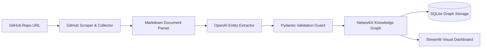

<div align="center">

# Developer Knowledge Engine

**Automated documentation ETL pipeline and knowledge graph builder transforming unstructured markdown into structured, queryable graphs.**

[](LICENSE)
[](https://www.python.org)
[](https://openai.com)
[](https://networkx.org)
[](https://streamlit.io)

[Report Bug](https://github.com/Justinvcj/Developer-Knowledge-Engine/issues) · [Request Feature](https://github.com/Justinvcj/Developer-Knowledge-Engine/issues)

</div>

---

```
┌─────────────────────┐      ┌─────────────────────┐      ┌─────────────────────┐
│ GitHub Repositories │ ───► │ Markdown Extraction │ ───► │ Structured OpenAI   │
│ (Raw Documentation) │      │ & Parsing Pipeline  │      │ Entity Extraction   │
└─────────────────────┘      └─────────────────────┘      └──────────┬──────────┘
                                                                     │
┌─────────────────────┐      ┌─────────────────────┐                 ▼
│ Interactive         │ ◄─── │ NetworkX / SQLite   │ ◄─── ┌─────────────────────┐
│ Streamlit Explorer  │      │ Relational Storage  │      │ Pydantic Validation │
└─────────────────────┘      └─────────────────────┘      │ Schema Guard        │
                                                          └─────────────────────┘
```

> Large developer codebases contain vast amounts of architectural knowledge buried inside fragmented markdown files, wikis, and issue threads, making system onboarding slow and error-prone.
> Developer Knowledge Engine automates documentation scraping, applies structured LLM extraction through strict Pydantic schemas, and builds persistent, navigable relational knowledge graphs.

---

## Features

- **Automated Repository Scraping** — Extracts raw markdown and documentation files directly from remote GitHub repositories.
- **LLM Entity & Relation Extraction** — Identifies technical concepts, architectural components, and relational dependencies with OpenAI models.
- **Zero-Hallucination Schema Guard** — Validates all extracted nodes and relationships against strict Pydantic models before storage.
- **Relational Knowledge Graph** — Constructs interconnected directed graphs using NetworkX and persists structured data in SQLite.
- **Interactive Visual Explorer** — Provides an intuitive Streamlit interface to search entities, inspect degrees of separation, and explore graph topology.

---

## Extraction Schema Model

The extraction pipeline enforces deterministic Pydantic schemas during OpenAI LLM invocation:

```python
class Node(BaseModel):
    entity_name: str  # Lowercase identifier
    entity_type: Literal['language', 'framework', 'database', 'tool', 'concept']

class Edge(BaseModel):
    source_entity_name: str
    target_entity_name: str
    relationship_type: Literal['uses', 'depends_on', 'alternative_to', 'improves', 'integrates_with']
    confidence_score: float = Field(ge=0.0, le=1.0)
```

---

## How It Works



---

## Quick Start

### Prerequisites

| Requirement | Version | Notes |
|---|---|---|
| [Python](https://www.python.org/) | 3.10+ | Core runtime |
| [OpenAI API Key](https://platform.openai.com/) | — | Required for entity extraction |
| [GitHub Token](https://github.com/settings/tokens) | Optional | Avoids GitHub API rate limits |

### Installation

1. Clone the repository:
   ```bash
   git clone https://github.com/Justinvcj/Developer-Knowledge-Engine.git
   cd Developer-Knowledge-Engine
   ```

2. Install dependencies:
   ```bash
   pip install -r requirements.txt
   ```

3. Configure environment variables:
   ```bash
   cp .env.example .env
   # Add OPENAI_API_KEY and optional GITHUB_TOKEN to .env
   ```

4. Launch the application:
   ```bash
   streamlit run main.py
   ```

### Usage

Enter a target GitHub repository URL (e.g., `https://github.com/tiangolo/fastapi`) into the Streamlit interface, trigger the extraction pipeline, and interact with the resulting knowledge graph.

---

## Configuration

| Variable | Required | Default | Description |
|---|---|---|---|
| `OPENAI_API_KEY` | Yes | — | API key for OpenAI model extraction |
| `GITHUB_TOKEN` | No | — | Personal access token for higher GitHub API rate limits |

---

## Tech Stack

| Layer | Technology |
|---|---|
| Core Engine | Python 3.10+, Requests, BeautifulSoup4, Markdown |
| AI & Extraction | OpenAI API (`gpt-4o` / `gpt-3.5-turbo`), Pydantic |
| Graph & Data | NetworkX, SQLite3 |
| Interface | Streamlit |
| Testing | Pytest |

---

## Testing

```bash
# Run unit and pipeline tests
pytest test_parser.py test_extractor.py test_pipeline.py
```

---

## Contributing

Contributions are welcome. Please open an issue first to discuss what you would like to change.

1. Fork the Project
2. Create your Feature Branch (`git checkout -b feat/EngineFeature`)
3. Commit your Changes (`git commit -m 'feat: add engine feature'`)
4. Push to the Branch (`git push origin feat/EngineFeature`)
5. Open a Pull Request

---

## License

Distributed under the MIT License. See [LICENSE](LICENSE) for details.
